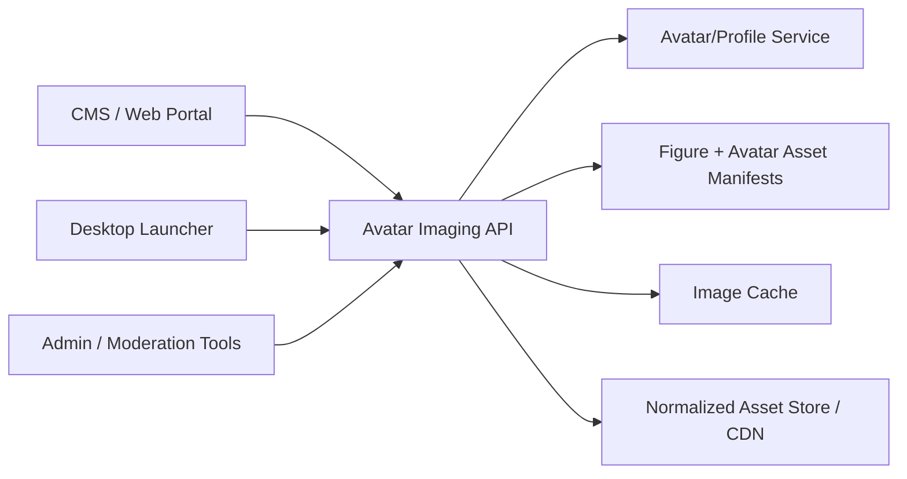

# Avatar Imaging Service

The avatar imaging service renders static or animated avatar images for web, launcher, admin, moderation, and social surfaces. It is not the game client and it is not the room runtime.

## Responsibility

| Responsibility | Why It Belongs Here |
| --- | --- |
| Render avatar preview images | CMS and launcher need images without booting the full game client. |
| Render user identity thumbnails | Friends, groups, profiles, moderation, and admin tools need stable identity visuals. |
| Cache expensive render outputs | Avatar composition is CPU and IO heavy when asset bundles must be loaded. |
| Prewarm common variants | Login, profile, and friend-list images should be fast. |
| Isolate image failures | Rendering bugs must not crash the CMS, launcher backend, or realtime room service. |

## Non-Responsibilities

- It does not authenticate game sessions.
- It does not launch the loader.
- It does not decide room presence.
- It does not own avatar state.
- It does not own economy, entitlements, or inventory.
- It does not replace client-side room avatar rendering.

## Source Of Truth

| Data | Source Of Truth | Imaging Service Role |
| --- | --- | --- |
| User selected figure | Account/avatar service | Reads snapshot or receives validated render request. |
| Wearable ownership | Inventory/avatar entitlement service | Trusts validated backend request, not raw client claim. |
| Effects ownership | Entitlement/effects service | Renders only authorized effects for user-bound images. |
| Figure composition | Figure-data manifests | Uses manifest to validate part and palette structure. |
| Render assets | Avatar asset manifests | Loads normalized, versioned bundles. |
| Output image | Imaging cache | Stores derived image only, never authoritative state. |

## Recommended API

| Endpoint | Caller | Purpose |
| --- | --- | --- |
| `GET /media/avatar/render` | CMS/launcher/internal tools | Render explicit figure options after validation. |
| `GET /media/avatar/user/{characterId}` | CMS/launcher/admin/moderation | Render current avatar for a known character. |
| `POST /internal/media/avatar/prewarm` | Avatar service / background worker | Pre-render common cache variants after a figure change. |
| `DELETE /internal/media/avatar/cache/{characterId}` | Avatar service / admin tools | Invalidate stale images after figure, wearable, or effect changes. |

## Render Contract

Minimum request fields:

- `figure`
- `size`
- `direction`
- `headDirection`
- `gesture`
- `action`
- `effect`
- `headOnly`
- `frame`
- `format`

Minimum response behavior:

- `200` with `image/png` or `image/gif` when successful.
- `400` for invalid render options.
- `403` for unauthorized user-bound wearables or effects.
- `404` when a referenced avatar/user does not exist.
- `409` when requested assets are missing from the active manifest.
- `429` when rate limits are exceeded.
- `500` only for unexpected renderer failure.

## Cache Key

The cache key must include:

- normalized figure string
- size
- direction
- head direction
- gesture
- action
- effect
- head-only flag
- frame number
- image format
- figure-data manifest key
- avatar-asset manifest key
- renderer version

If any manifest changes, the old cache must not be reused silently.

## Runtime Architecture

## Implementation Options

| Option | Use When | Tradeoff |
| --- | --- | --- |
| TypeScript + Express + node-canvas | Fastest path if adapting Nitro-style rendering concepts. | Native `canvas` dependency needs careful CI and packaging. |
| .NET + ImageSharp/SkiaSharp | Best alignment with existing Epsilon backend. | More renderer work must be written from scratch. |
| Dedicated worker queue | Needed when render volume grows. | Adds queue complexity; not required for first MVP. |

Recommended MVP: TypeScript service behind the launcher/CMS backend, because `nitro-imager` already proves the shape of the problem. Recommended long-term: keep the service boundary stable, then decide whether to retain TypeScript or port the renderer to .NET after the asset model is stable.

## Required Guards

- Strict figure string validation.
- Allowlisted action, gesture, size, direction, effect, and output format.
- Maximum output dimensions.
- Rate limiting by IP, account, and caller service.
- Disk cache quota.
- Asset URL allowlist.
- No arbitrary filesystem paths in requests.
- Structured render error logging without leaking local paths.

## Reference

The architecture reference is documented in:

- [nitro-imager.md](/Users/yasminluengo/Documents/Playground/EpsilonEmulator/docs/reference-sources/nitro-imager.md)
