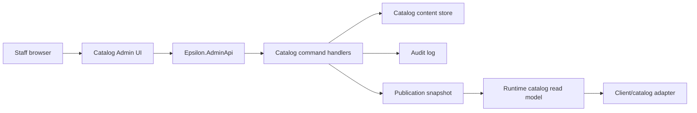

# Catalog Admin Tooling

This document defines the Epsilon catalog administration boundary. The Arcturus Catalog Panel reference shows a useful editing workflow, but Epsilon needs a safer architecture because catalog changes affect live economy, item grants, client compatibility, and player trust.

Reference: [arcturus-catalog-panel.md](/Users/yasminluengo/Documents/Playground/EpsilonEmulator/docs/reference-sources/arcturus-catalog-panel.md)

## Purpose

Catalog admin tooling lets authorized staff manage catalog pages, page ordering, campaign surfaces, visual previews, offer placement, and publication state without editing database rows directly.

The tool exists to make staff productive while preserving runtime safety. It is not part of the public CMS, launcher, game loader, or emulator runtime.

## Boundary

| Surface | Responsibility | Must Not Do |
| --- | --- | --- |
| Public CMS | Show account/community surfaces and launch entry points. | Mutate catalog pages or offers. |
| Catalog Admin UI | Provide staff editing UX for catalog hierarchy, copy, previews, and publication. | Write directly to storage or simulate purchases. |
| `Epsilon.AdminApi` | Authenticate staff, authorize commands, validate mutations, and return admin read models. | Expose endpoints to normal users. |
| Catalog service | Own catalog domain rules, page hierarchy, offer mapping, and publication. | Depend on browser-only UI assumptions. |
| Runtime/gateway | Serve client-compatible catalog snapshots and execute purchases. | Accept admin-only mutation commands. |

## Architecture

## Required Commands

| Command | Purpose | Required Controls |
| --- | --- | --- |
| `CreateCatalogPageDraft` | Create a page without exposing it live. | Staff role, parent validation, audit log. |
| `UpdateCatalogPageDraft` | Edit caption, layout, rank, copy, and visual references. | Field validation, asset allowlist, optimistic version. |
| `MoveCatalogPage` | Move a page under a different parent or tab. | Cycle prevention, rank compatibility, audit log. |
| `ReorderCatalogPages` | Change visible ordering. | Transactional update, stale version rejection. |
| `ArchiveCatalogPage` | Remove from active editing without hard deletion. | Linked offer checks, restore path. |
| `PublishCatalogDraft` | Promote a validated draft to live. | Atomic publication, compatibility projection, audit event. |
| `RollbackCatalogPublication` | Restore a previous safe version. | Elevated permission, incident note, audit event. |

## Source Of Truth

The live source of truth is the server-side catalog publication snapshot, not the admin UI.

The client receives projected catalog data suitable for its runtime family. The canonical catalog may include richer metadata than older clients can render, so compatibility projection must stay separate from admin editing.

## Data Concepts

| Concept | Meaning |
| --- | --- |
| `CatalogPageDraft` | Editable staff version of a page. |
| `CatalogPageVersion` | Immutable recorded version of a page after save or publish. |
| `CatalogPublication` | Atomic set of page, offer, pricing, layout, and compatibility data used by runtime. |
| `CatalogLayoutDefinition` | Server-known layout key and supported content slots. |
| `CatalogVisualReference` | Validated image, teaser, icon, or headline asset reference. |
| `CatalogAuditEvent` | Append-only record of who changed what, when, and why. |

## Validation Rules

- Page hierarchy must not contain cycles.
- Page ids and offer ids must be stable across publications.
- Visibility, minimum rank, and enabled state must be validated server-side.
- Image and icon references must be resolved from known asset manifests.
- Offer placement must reference valid catalog offers.
- Publication must fail if any target client adapter cannot project the active catalog safely.
- Staff cannot publish changes without the required role.

## What Not To Do

- Do not let the admin frontend write directly to database tables.
- Do not place catalog mutation endpoints in the public CMS.
- Do not hard delete catalog pages from normal staff workflows.
- Do not let launcher or client code decide catalog ownership, price, or grants.
- Do not publish partial catalog changes without an atomic snapshot.
- Do not treat legacy SQL table shape as the canonical Epsilon domain model.

## First Implementation Slice

Build this in the smallest safe order:

1. Admin read model for catalog page tree.
2. Staff-authenticated `CreateCatalogPageDraft` and `UpdateCatalogPageDraft`.
3. Audited `ReorderCatalogPages`.
4. Asset preview resolver using canonical asset manifests.
5. Draft-to-publication flow.
6. Runtime catalog snapshot projection.
7. Rollback command.

This order gives the team a useful staff tool while protecting the live economy and runtime client compatibility.
