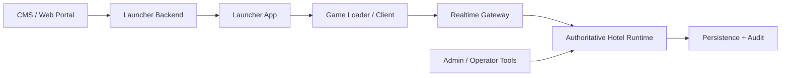

# Emulator Reference Model

Epsilon uses emulator projects as architecture references only. The goal is to understand mature runtime boundaries, not to copy packet maps, schemas, or source code.

## Reference Sources

| Source | Role | Policy |
| --- | --- | --- |
| [Arcturus Community](/Users/yasminluengo/Documents/Playground/EpsilonEmulator/docs/reference-sources/arcturus-community.md) | Mature Java monolithic hotel emulator reference. | Architecture and domain inventory only. |
| [Arcturus Morningstar Default SWF Pack](/Users/yasminluengo/Documents/Playground/EpsilonEmulator/docs/reference-sources/arcturus-morningstar-default-swf-pack.md) | Client/SWF/content-pack reference. | Asset and client taxonomy only. |
| [Nitro Imager](/Users/yasminluengo/Documents/Playground/EpsilonEmulator/docs/reference-sources/nitro-imager.md) | Server-side avatar imaging reference. | Imaging service design only. |

## Correct Boundary

The CMS is not the game. The launcher is not the game. The loader/client is not authoritative. The runtime/emulator layer owns gameplay truth.

## Runtime Domains To Keep Explicit

| Domain | Why It Matters |
| --- | --- |
| Authentication/session | Prevents fake entry, duplicate login, expired tickets, and unauthorized actions. |
| Realtime gateway | Isolates transport, rate limits, protocol adapters, and connection lifecycle. |
| User/profile | Stores durable identity, motto, figure, subscriptions, badges, and status. |
| Room runtime | Owns active actor, item, chat, permission, movement, and game state. |
| Inventory | Owns item possession and transfer into/out of rooms. |
| Catalog/shop | Owns offers, pricing, grants, limited items, and purchase validation. |
| Wallet/currency | Owns balances and append-only ledger changes. |
| Trading | Owns two-party item/currency exchange integrity. |
| Navigator | Owns room discovery read models. |
| Social | Owns friends, messenger, groups, and presence read models. |
| Moderation | Owns reports, sanctions, word filter, staff actions, and audit evidence. |
| Operator/admin | Owns privileged commands, diagnostics, and runtime correction tools. |
| Plugin/extensions | Owns controlled custom behavior after core invariants are protected. |

## Architecture Decision

Epsilon should not copy the legacy monolith shape. The correct approach is:

1. Keep a modular backend first.
2. Keep transport adapters outside game rules.
3. Keep room simulation testable and deterministic.
4. Keep economy actions transactional and audited.
5. Keep admin/operator actions explicit and permissioned.
6. Keep CMS/launcher/loader separated from runtime authority.

## What Not To Do

- Do not put room simulation inside the CMS.
- Do not let the launcher mark a user as inside the hotel.
- Do not store economic state only in memory.
- Do not let protocol handlers mutate database records directly.
- Do not expose raw operator commands publicly.
- Do not copy GPL source into Epsilon unless the project intentionally accepts GPL obligations.
- Do not import packet ids or protocol maps into core domain code.

## Epsilon Build Priority From This Reference

1. Session and launch-ticket validation.
2. Realtime gateway command execution.
3. Room entry as an emulator-confirmed transition.
4. Room actor state and movement.
5. Chat with moderation hooks.
6. Inventory ownership and room item placement.
7. Catalog purchase with wallet ledger.
8. Trading with transactional safety.
9. Admin/moderation console and operator command model.
10. Plugin/event surface after the core is stable.
