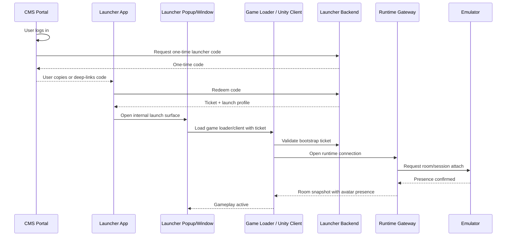

# Launcher Popup To Game Loader Flow

Date: 2026-04-23

This document defines the popup/window layer between the launcher app and the game loader. The popup is not the CMS. It is a launcher-owned launch surface.

## Decision

The launcher app may open a popup, child window, embedded webview, or native loading panel. That surface must go directly to the internal game loader or native client package.

The CMS only gives the player an access code and launcher entry point. It does not launch gameplay.

## Runtime Chain

## State Ownership

| State | Owner | Reason |
| --- | --- | --- |
| Web login session | CMS | It is account/community state. |
| One-time access code | Launcher backend | It bridges CMS to launcher without exposing full session state. |
| Ticket | Launcher backend | It authorizes a specific launch attempt. |
| Popup/window open | Launcher app | It is local launch UX, not game presence. |
| Loader boot state | Game loader / Unity client | It prepares runtime connection and assets. |
| Room presence | Runtime gateway / emulator | It is authoritative gameplay state. |

## Popup Requirements

The popup/window must:

- be opened by the launcher app, not by the CMS as a fake game session
- receive only the minimum launch context needed to start the loader
- pass the ticket to the game loader without exposing long-lived credentials
- show loading and retry states
- close or downgrade gracefully if the loader fails
- never claim hotel presence

## Implementation Targets

| Target | MVP Behavior | Production Behavior |
| --- | --- | --- |
| Electron launcher | Open a dedicated `BrowserWindow` with the loader URL. | Use signed packages, integrity checks, crash telemetry, and locked navigation. |
| Avalonia launcher | Open internal WebView/native child window if available; otherwise open OS fallback only as development mode. | Replace fallback browser launch with packaged client process or embedded WebView. |
| Unity client | Not required for first runtime contract test. | Accept ticket, validate bootstrap, load Addressables, connect to runtime gateway. |
| Web game loader | Temporary client boot surface. | Kept as dev/test loader or replaced by Unity/WebGL/native package. |

## Failure Rules

- If code redemption fails, stay in launcher.
- If profile selection fails, stay in launcher.
- If popup/window cannot open, record `launcher_popup_open_failed`.
- If loader bootstrap fails, show loader error and return to launcher.
- If runtime connection fails, retry from loader.
- If presence is not confirmed, keep gameplay disabled.

## What Not To Do

- Do not route CMS login directly to `/assets/clients/...` as if the launcher did its job.
- Do not show CMS profile/community panels inside the loader.
- Do not use popup open as proof of game entry.
- Do not let the popup execute room actions.
- Do not duplicate code entry in CMS and loader; the code is copied once from CMS and redeemed once by launcher.
