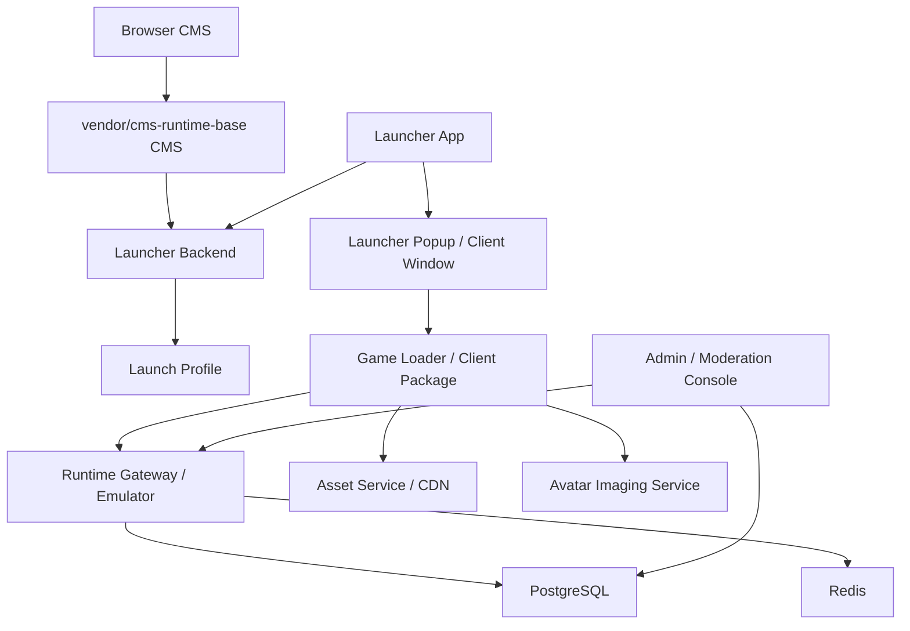

# Local Orchestration Topology

This document translates useful service topology patterns from the adopted local CMS runtime base into Epsilon's own architecture language.

It does not make the CMS runtime base a production runtime dependency. It defines how Epsilon should run locally and later in production-like environments while preserving strict CMS, launcher, loader, runtime, asset, and data boundaries.

## Core Rule

The product may look like one game to the player, but the platform must run as multiple bounded services:

- CMS/public portal
- launcher backend
- launcher app
- game loader/client package
- runtime gateway/emulator
- asset service/CDN
- avatar imaging service
- database
- Redis hot-state layer
- admin/operator APIs
- background jobs/backups

The CMS is never the game. The launcher is never the game. The loader is only the client boot/runtime surface. The emulator/runtime gateway is the authority.

## Target Local Service Map

| Epsilon Service | Local Port | Responsibility | Depends On | Reference Analogue |
| --- | ---: | --- | --- | --- |
| `vendor/cms-runtime-base` CMS | `8081` | Temporary public portal, account/community surface, and base CMS while Epsilon rebuilds its own CMS | MySQL, assets, emulator config | `cms` |
| `Epsilon.Launcher` | `5001` | Access-code redemption, launch profiles, client package routing, launcher telemetry | Gateway, assets | launcher handoff |
| `Epsilon.Gateway` | `5000` or `5100` | HTTP runtime APIs, bootstrap, future realtime gateway, runtime command authority | PostgreSQL/Redis when enabled | runtime authority |
| Future `Runtime WSS` | `wss://localhost:*` | Authoritative room session transport | Gateway/runtime domain | realtime transport |
| Future `Epsilon.Assets` | `5200` | Versioned static assets, game data manifests, client bundles | object storage/local assets | `assets` |
| Future `Avatar Imaging` | `5201` | Server-side avatar/profile image rendering | assets, figure manifests | `imager` |
| Future `Media Proxy` | internal | Optional external media proxy with allowlist/cache | asset policy | `imgproxy` |
| PostgreSQL | `5432` local profile | Durable hotel source of truth | migrations | `db` |
| Redis | `6379` local profile | Hot sessions, presence, flood control, room coordination | runtime services | shared hot-state layer |
| Admin API | `5300` future | Moderation, operations, support, content tools | gateway, auth, persistence | RCON/admin role replacement |
| Backup jobs | none | Scheduled DB and manifest backup | PostgreSQL/object storage | `backup` |

## Runtime Boundary Diagram

## Correct End-To-End Flow

1. User opens CMS.
2. User registers or logs in.
3. CMS creates or displays a one-time launcher access code.
4. User opens launcher app.
5. Launcher app checks update channel and local client package state.
6. Launcher app redeems the code with `Epsilon.Launcher`.
7. `Epsilon.Launcher` returns a short-lived ticket and a launch profile.
8. Launcher app opens an internal popup/window or starts the packaged client.
9. Game loader validates the ticket and reads the launch profile.
10. Game loader connects to the runtime gateway.
11. Runtime gateway validates the session and requests room entry.
12. Runtime confirms avatar presence in a room snapshot.
13. Only after that confirmation can the UI show real in-hotel controls.

## Presence State Machine

| State | Meaning | Who Can Set It |
| --- | --- | --- |
| `web_authenticated` | User is logged into CMS. | CMS backend |
| `launcher_code_issued` | CMS produced a launcher handoff code. | CMS backend |
| `launcher_code_redeemed` | Launcher exchanged code for launch ticket/profile. | Launcher backend |
| `client_started` | Launcher opened the client window/package. | Launcher app or loader telemetry |
| `runtime_connected` | Loader/client connected to runtime gateway. | Runtime gateway |
| `room_join_requested` | Client asked runtime to join a room. | Runtime gateway |
| `room_join_accepted` | Runtime accepted the join request. | Runtime gateway |
| `presence_confirmed` | Avatar exists in authoritative room state/snapshot. | Runtime gateway/emulator only |

The UI must never compress these states into one generic "entered" flag.

## Launch Profile Shape

A launch profile is the neutral Epsilon equivalent of a client renderer config. It should be generated by the launcher backend and validated by the loader/client.

| Section | Required Fields | Purpose |
| --- | --- | --- |
| `profile` | `profileKey`, `displayName`, `clientKind`, `version` | Identifies the selected client package/channel. |
| `runtime` | `bootstrapUrl`, `realtimeUrl`, `heartbeatIntervalMs`, `protocolVersion` | Tells the client where and how to connect. |
| `assets` | `baseUrl`, `manifestUrl`, `bundleTemplates`, `hashAlgorithm` | Tells the client where versioned assets are loaded from. |
| `content` | `localizationUrls`, `itemDefinitionsUrl`, `avatarFigureDataUrl`, `avatarAssetMapUrl` | Tells the client which manifests to hydrate. |
| `security` | `ticketExpiresAt`, `allowedOrigins`, `integrityPolicy` | Limits token and asset trust. |
| `telemetry` | `clientStartedUrl`, `crashReportUrl`, `eventIngestUrl` | Records launcher/client failure points separately. |

Player-facing UI should show product terms such as "Play", "Launch game", or "Open client", not development labels like `web-alpha`.

## Environment Profiles

| Profile | Purpose | Rules |
| --- | --- | --- |
| `local-single-process` | Fast development with in-memory fallbacks | Allowed only when gateway and launcher share process/state assumptions. |
| `local-multiprocess` | Realistic local test with CMS, launcher, gateway, Redis, DB | Required before claiming registration-to-runtime flow works. |
| `qa` | Shared test environment | Requires persistent DB, Redis, seeded content, structured logs, and repeatable reset scripts. |
| `staging` | Production-like validation | Requires TLS, reverse proxy, backups, metrics, alerts, and migration rehearsal. |
| `production` | Live player environment | No direct DB port, no plaintext gameplay transport, no in-memory authority. |

## Recommended Compose Shape

Epsilon should eventually provide compose profiles, but the service boundaries must remain Epsilon-owned:

| Compose Service | Image/Runtime | Notes |
| --- | --- | --- |
| `gateway` | `.NET` | Hosts gateway/runtime HTTP and future realtime transport. |
| `launcher` | `.NET` | Hosts launcher access-code and launch-profile APIs. |
| `cms` | Adopted `vendor/cms-runtime-base` container for now | Public portal only. Replace with original Epsilon CMS when ready. |
| `postgres` | `postgres` | Durable state. |
| `redis` | `redis` | Shared sessions and hot runtime state. |
| `assets` | nginx or object-storage emulator | Static manifests and bundles. |
| `imager` | Node.js or .NET worker/API | Avatar image rendering. |
| `admin` | `.NET` API plus web UI | Staff-only surface. |
| `backup` | scheduled job image | DB and asset manifest backups. |

## Validation Requirements

Before a local stack can be called operational:

1. CMS registration creates a durable user/account.
2. CMS login creates only a web session, not hotel presence.
3. CMS access-code button creates a one-time launcher code.
4. Launcher redemption invalidates the code after use.
5. Launcher receives a typed launch profile.
6. Loader/client validates ticket before runtime connection.
7. Runtime rejects expired or reused tickets.
8. Runtime confirms room presence before chat or movement is enabled.
9. Room snapshot matches the current authenticated character.
10. Telemetry records each stage separately.

## Reference Validation Notes

The adopted CMS runtime base was run locally to validate the separation model. The result reinforces these Epsilon rules:

- A static client can be healthy while the emulator database is still invalid. Therefore, client availability is not proof of gameplay readiness.
- An emulator can expose WebSocket transport while still emitting content/config warnings. Therefore, runtime readiness needs health checks beyond open ports.
- An imager is not optional for a CMS/game portal that displays avatar previews. It must have access to converted figure data and bundles.
- Asset conversion is an offline or tooling concern. It should not run inside CMS request handling or launcher startup.
- CMS installation/migration state is separate from runtime schema state. Epsilon must not collapse website migrations and game runtime migrations into one hidden step.
- The correct "ready to play" gate is an integration test that covers CMS login, launcher code redemption, client boot profile, runtime ticket validation, and authoritative room join confirmation.

## What Not To Do

- Do not copy AGPL Docker code directly unless the project intentionally accepts AGPL consequences.
- Do not make the adopted CMS runtime or any third-party CMS the Epsilon architecture.
- Do not expose database ports in production.
- Do not use RCON-style runtime control as the public admin model.
- Do not let the launcher set hotel presence.
- Do not show debug launch profiles as player UI.
- Do not combine asset conversion, CMS login, and runtime presence into one page.
- Do not make external asset URLs authoritative for inventory, wallet, or ownership.

## Immediate Epsilon Work Items

1. Add a typed launch-profile schema and validator.
2. Add local multiprocess orchestration for CMS, launcher, gateway, Redis, and PostgreSQL.
3. Add asset-service manifest endpoints before final client-package loader work.
4. Add avatar imaging as a separate service boundary.
5. Add integration tests for the complete state machine from `web_authenticated` to `presence_confirmed`.
6. Replace remaining in-memory continuity points with PostgreSQL/Redis-backed implementations.
