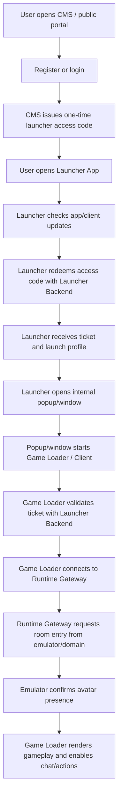

# Modular CMS, Launcher, and Game Loader Architecture

Date: 2026-04-23

This document is the boundary rule for the 2026 Epsilon access architecture. It exists to prevent the CMS, launcher application, and game loader from being collapsed into one confused surface.

## Core Decision

The CMS, launcher app, and game loader are separate components.

They collaborate through explicit APIs, short-lived session handoff tokens, telemetry, and runtime gateway contracts. They must not share UI responsibilities, runtime authority, or persistence assumptions.

## Component Responsibilities

| Component | What It Is | Primary Responsibility | Must Not Do |
| --- | --- | --- | --- |
| CMS / public portal | Web product surface for accounts and community | Register/login users, show home/community/profile/support content, issue launcher access codes | Run the game, simulate rooms, confirm hotel presence, render gameplay |
| CMS backend | Web/account/content API | Own web sessions, public identity, CMS content, support/community payloads, launcher handoff creation | Become the realtime room server or source of truth for active gameplay |
| Launcher backend | API surface served by `Epsilon.Launcher` | Redeem launcher codes, validate tickets, return launch profiles, receive launcher/client telemetry | Pretend a user is inside the hotel before runtime confirmation |
| Launcher app | Native/desktop/mobile gateway application | Check updates, redeem code, choose launch profile, download/verify client package, open the launcher-owned popup/window, start game client or loader | Render rooms, own economy, own inventory, fake presence |
| Launcher popup/window | Launcher-owned transition surface | Open or embed the internal game loader/client package after profile selection | Become CMS UI, accept registration, mutate gameplay, claim presence |
| Game loader | Client boot surface; currently web-based, later Unity/WebGL/WebAssembly or native client package | Validate launch ticket, bootstrap client state, connect to runtime gateway, load assets, render the game client surface | Authenticate web accounts directly, replace CMS, decide ownership/economy, mark presence without emulator proof |
| Runtime gateway / emulator | Authoritative gameplay backend | Validate realtime session, join rooms, confirm presence, process chat/movement/interactions, produce room snapshots | Depend on CMS UI state or trust client-only claims |
| Admin/moderation tools | Staff-only operational surface | Moderate, inspect, support, audit, feature-flag, operate live service | Be exposed as player CMS APIs or mixed into launcher gameplay flow |

## Correct Interaction Flow

## API Ownership

| API Family | Owner | Example Responsibility | Consumer |
| --- | --- | --- | --- |
| `/cms/api/auth/*` | CMS backend | Register, login, logout, web session state | Browser CMS |
| `/cms/api/home`, `/cms/api/community`, `/cms/api/support` | CMS backend | Community/product content | Browser CMS, future mobile app |
| `/cms/api/launcher/session` | CMS backend | Create or expose launcher handoff intent for authenticated web user | Browser CMS |
| `/launcher/access-codes/*` | Launcher backend | Issue/current/redeem one-time launcher codes | CMS, Launcher App |
| `/launcher/bootstrap` | Launcher backend | Validate ticket and produce boot context | Game Loader / Client |
| `/launcher/client-started` | Launcher backend | Record client process start telemetry | Launcher App or Game Loader |
| `/launcher/runtime/*` | Launcher backend facade over runtime gateway | Temporary development bridge for room entry/snapshot/chat | Game Loader only |
| Future `/runtime/realtime` or `wss://runtime` | Runtime gateway / emulator | Authoritative realtime gameplay | Game Client / Loader |
| `/admin/*` | Admin API | Staff/moderation/operations | Staff tools only |

## Boundary Rules

1. CMS login is not game login. It creates a web session and may request a launcher handoff.
2. Launcher code redemption is not room entry. It only proves the launcher can start a client with a valid ticket.
3. Popup/window opened is not presence. It only proves the launcher opened the local launch surface.
4. Client started is not presence. It only proves a client process or loader surface has opened.
5. Room entry accepted is not presence. It means the runtime accepted the request, but the avatar still needs to appear in authoritative runtime state.
6. Presence is real only when the emulator/runtime gateway confirms the avatar in the room snapshot.
7. Chat, movement, placement, economy, trading, and ownership operations must be server-authoritative.
8. The CMS can show summaries of hotel state, but it must not mutate active room state directly.
9. The launcher can pass a ticket to the loader/client, but it must not inspect or decide gameplay state.
10. The game loader may render gameplay, but it must not directly trust CMS profile data for runtime actions.

## Launcher Popup Clarification

The popup/window belongs to the launcher layer.

Its job is to bridge from a redeemed launcher ticket into the internal game loader or packaged Unity/WebGL/native client. It is not a CMS page, and it must not repeat registration, login, code issue, profile pages, community pages, or catalog editing.

The popup may show:

- loading state
- update state
- loader start errors
- retry and reconnect actions
- safe return to launcher

The popup must not show:

- CMS registration/login
- community/home/news UI
- player catalog admin/editing
- room controls before runtime presence
- any message that implies the user is inside the hotel before emulator confirmation

## Game Loader Clarification

The current `game-loader` is a temporary web client boot surface. It should behave like the future Unity/WebGL/WebAssembly loader:

- validate a short-lived ticket
- load/prepare client assets
- connect to the runtime gateway
- request room entry
- wait for emulator-confirmed presence
- render game UI only after authoritative state exists

It is not the CMS and should not contain CMS navigation, registration, community panels, support panels, or editorial content.

## Launcher App Clarification

The launcher app is a gateway and updater. Its job is comparable to a desktop game launcher:

- local config
- update channel selection
- package manifest checks
- hash/integrity verification
- launch profile selection
- secure session handoff
- crash/telemetry reporting

It is not the game runtime. It launches the game runtime.

## CMS Clarification

The CMS is a product and community portal:

- account creation
- login
- homepage
- news
- profiles
- community
- support
- access method selection
- launcher access code display/copy

It may call launcher handoff APIs, but it never becomes the loader.

## Implementation Consequences

- Shared contracts are allowed; shared state ownership is not.
- A component may consume another component's API; it does not inherit that component's responsibility.
- UI labels must name the correct layer: `portal/CMS`, `Launcher App`, `Launcher Backend`, `Game Loader`, `Runtime Gateway`, or `Emulator`.
- Tests must assert that a user is not marked inside the hotel until runtime presence is confirmed.
- Telemetry must preserve each stage separately: code issued, code redeemed, client started, room entry requested, room entry accepted, presence confirmed.

## What Not To Do

- Do not put registration/login inside the game loader.
- Do not put room controls inside the CMS.
- Do not mark the user as inside the hotel from the launcher.
- Do not let the loader render debug bootstrap JSON as the player experience.
- Do not let CMS endpoints become authoritative for chat, movement, item placement, inventory ownership, wallet balances, or trades.
- Do not hardcode `web-alpha` or similar development profile labels into player-facing launcher UI.

## Current Epsilon Status

| Area | Status |
| --- | --- |
| CMS login/register/access choice | Implemented but still needs product hardening. |
| Launcher code flow | Implemented. |
| Native launcher shell | Implemented for macOS workflow, still needs package/update hardening. |
| Launcher popup/window boundary | Defined; Electron opens an internal client window, Avalonia still needs a non-browser production target. |
| Temporary game-loader | Implemented as boot/runtime validation surface. |
| Final desktop client package | Not implemented yet. |
| Runtime presence confirmation | Implemented as a required state before chat/actions. |
| Durable persistence | Still incomplete; too much development state remains in memory. |

## Next Engineering Steps

1. Keep CMS polish focused on account/community/access-code UX only.
2. Keep launcher app work focused on update channels, launch profiles, package verification, and code redemption.
3. Move popup/window behavior into the launcher layer, not the CMS layer.
4. Keep game-loader work focused on ticket validation, asset loading, runtime connection, and emulator-confirmed presence.
5. Replace the temporary web loader with a Unity/WebGL/WebAssembly or native client package only after the launcher contract is stable.
6. Add automated tests that fail if CMS, launcher, or popup events mark real hotel presence.

Related requirements: [project-requirements.md](/Users/yasminluengo/Documents/Playground/EpsilonEmulator/docs/requirements/project-requirements.md) and [launcher-handoff-flow.md](/Users/yasminluengo/Documents/Playground/EpsilonEmulator/docs/architecture/launcher-handoff-flow.md).
