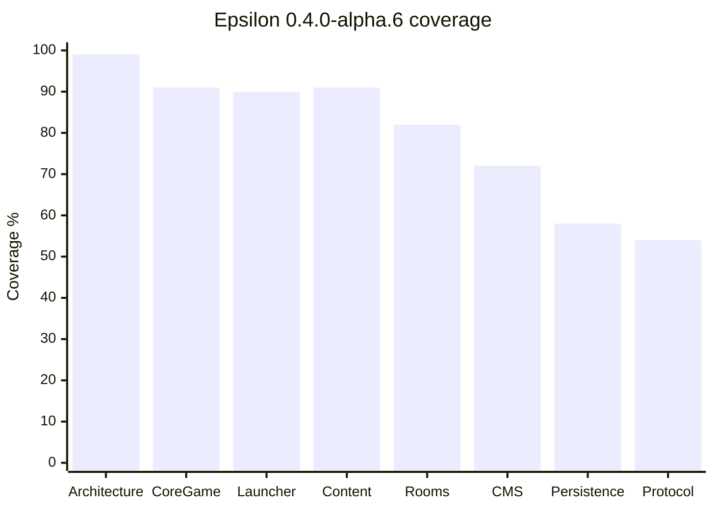

# Release `0.4.0-alpha.6`

Date: `2026-04-24`

## Release Name

**Epsilon Web Identity Pass**

This alpha release aligns the public repository identity, active CMS runtime, and
launcher access story under one clean Epsilon presentation.

## Summary

`0.4.0-alpha.6` is a hygiene, identity, and documentation release. It does not
claim that the CMS is production ready. It makes the active local CMS more
coherent, removes visible inherited branding from the runtime surface, installs
official Epsilon pixel logos, and documents the remaining risk honestly.

The critical product rule remains unchanged:

```text
CMS authenticates and presents access
Launcher starts the loader/client
Game loader connects to runtime
Emulator confirms real hotel presence
```

The CMS must not pretend the user is already inside the hotel. The launcher must
not pretend the user is already inside the hotel. Only the emulator runtime can
confirm presence.

## Included

### Branding

- `assets/epsilon-cms-logo.gif` added as the active CMS logo source.
- `assets/epsilon-emulator-logo.gif` added as the repository/GitHub presentation logo.
- Older heavyweight repository logo usage removed from the active README.
- Active CMS sanitizer now installs the official GIF logo into the CMS runtime.

### CMS Runtime

- CMS settings now identify the surface as **Epsilon Web Management System**.
- CMS active runtime settings are sanitized for local development.
- CMS language selector is limited to:
  - English
  - Spanish
  - Portuguese
  - French
  - Russian
- Runtime wording keeps the CMS separated from the game loader and emulator.

### Documentation

- README updated to `0.4.0-alpha.6`.
- Changelog updated with the release scope.
- Roadmap updated with the current milestone and remaining CMS risks.
- Development graph added to show system maturity by track.
- Requirements are restated in the README for developers and community reviewers.

## Requirements

| Requirement | Purpose | Required For This Release |
| --- | --- | --- |
| `.NET SDK 10` | Backend, gateway, launcher backend, tests | Yes |
| Docker / Docker Desktop | Local database, cache, CMS runtime stack | Yes |
| Node.js + npm | CMS/tooling/launcher shell work | Yes |
| Unity Hub / Unity Editor | Future Unity client package | Optional |
| macOS packaging tools | DMG generation for native launcher | Optional |

## Development Progress



| System | Coverage | Release Interpretation |
| --- | ---: | --- |
| Architecture | `99%` | Boundaries between CMS, launcher, client, and emulator are now explicit. |
| Core game | `91%` | Hotel domain work is advanced, but final protocol parity remains incomplete. |
| Launcher | `90%` | Handoff model is correct; production packaging still needs hardening. |
| Content | `91%` | Catalog/content modeling is strong; final client asset packaging remains open. |
| Rooms | `82%` | Room runtime is solid but needs deeper furni mutation and pathing completeness. |
| CMS | `72%` | The CMS is usable locally and visually cleaner, but it still needs hardening. |
| Persistence | `58%` | Too much runtime behavior still depends on in-memory storage. |
| Protocol | `54%` | Protocol execution still trails the HTTP/runtime path. |

## Known Instability

- CMS registration/access still needs production-grade validation, security review,
  and stronger failure handling.
- The active CMS base is adopted for bootstrap speed; it must continue being
  sanitized and reduced before public use.
- Desktop launcher packages exist, but final release signing/notarization is not done.
- The current loader is provisional and must be replaced by the final client package.
- Runtime durability is still blocked by remaining `InMemory` slices.

## Verification Notes

The release should be verified with:

```bash
./tools/cms_runtime_sanitize.sh
./tools/cms_runtime_audit.sh
./tools/verify_workspace.sh
```

The CMS is expected at:

```text
http://127.0.0.1:8081/
```

The authenticated user portal is expected at:

```text
http://127.0.0.1:8081/user/me
```

## Release Decision

This is a valid alpha release because it makes the project clearer, lighter, and
more coherent for contributors. It is not a production release. The next release
must prioritize CMS registration hardening, durable persistence, launcher package
stability, and the final client loader path.
